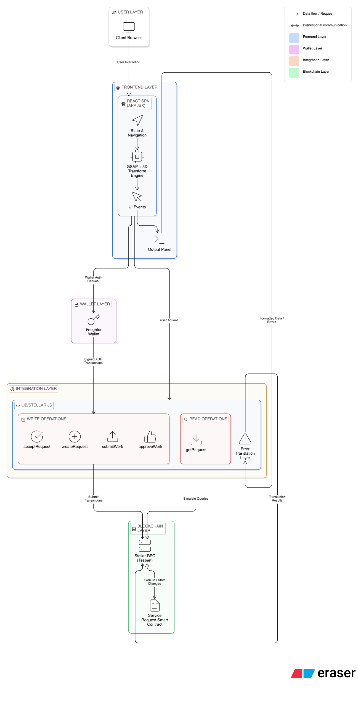

# Service Request System

A decentralized application built on Stellar Soroban that enables users to create work orders, accept jobs, submit deliverables, and manage approvals entirely on-chain.

## Features

- **Decentralized Service Requests**: Create non-custodial work orders with attached budgets.
- **Provider Workflow**: Service providers can pick up open requests and submit comprehensive work notes upon completion.
- **On-chain Approval System**: Requesters have the final say, accepting or rejecting with defined reasons.
- **Stellar Wallet Integration**: Connect seamlessly using the Freighter browser extension.
- **Premium 3D UI**: fluid, GSAP-powered interface that makes utilizing smart contracts an elegant experience.

## Tech Stack

- **Frontend**: React.js, Vite
- **Styling & Animations**: Modern CSS, GSAP (GreenSock Animation Platform) for immersive 3D/micro-animations
- **Blockchain**: Stellar SDK, Soroban RPC, Freighter API

## Getting Started

1. Install dependencies:
   ```bash
   npm install
   ```

2. Run the development server:
   ```bash
   npm run dev
   ```

3. Make sure you have the [Freighter Wallet](https://freighter.app/) extension installed in your browser.

## System Architecture



Our dApp follows a 5-layer decentralized architecture:

1. **User Layer**: The entry point where users interact with the app via their Client Browser.
2. **Frontend Layer**: 
    - A React Single Page Application (SPA), primarily driven by `App.jsx`.
    - Handles **State & Navigation** locally for seamless transitions.
    - Utilizes a **GSAP + 3D Transform Engine** to interpret UI Events and deliver an immersive, polished component experience.
    - Features an **Output Panel** logic that beautifully renders responses securely.
3. **Wallet Layer**: Operates as a secure bridge, sending Wallet Auth Requests from the frontend to the **Freighter Wallet** browser extension, which signs actions and passes back Signed XDR Transactions.
4. **Integration Layer** (`lib/stellar.js`): The orchestrator that manages all interactions with the blockchain.
    - **Write Operations**: Actions like `createRequest`, `acceptRequest`, `submitWork`, and `approveWork` compile user actions and wallet signatures to submit transactions.
    - **Read Operations**: Queries like `getRequest` simulate queries against the blockchain to fetch the latest state.
    - **Error Translation Layer**: Catches raw transaction execution results directly from the network, translating opaque Soroban VM error codes into friendly UI alerts.
5. **Blockchain Layer (Stellar Testnet)**: Final execution layer consisting of the Stellar RPC endpoints interacting continuously with the decentralized **Service Request Smart Contract** which securely executes and stores state changes.

## Project Structure

- `/src/App.jsx` - Main application logic, workflow dashboard, and React SPA
- `/src/App.css` - UI Design System and GSAP animations
- `/lib/stellar.js` - On-chain Integration Layer and Error Parsing Utilities

## License

MIT
